# Лабораторная работа №2: Виртуальный сервер
**Каварналы Анастасия, IA2403** 
**Дата:** 19.02.2026

## 1. Цель работы:

- Установить серверную ОС Debian без графического интерфейса в QEMU
- Создать виртуальный диск формата qcow2
- Настроить стек LAMP (Linux + Apache + MariaDB + PHP)
- Развернуть phpMyAdmin и WordPress
- Настроить VirtualHost и проверить работу сайтов через проброс портов

## 2. Задание

1. Подготовить репозиторий `containers02` и структуру проекта (включая `.gitignore` и ISO в папке `dvd`)
2. Создать виртуальный диск `qcow2`, установить Debian в QEMU
3. Запустить VM с пробросом портов (HTTP и SSH)
4. Установить LAMP, скачать и распаковать WordPress и PhpMyAdmin
5. Создать БД и пользователя для WordPress в MariaDB
6. Настроить отдельные конфигурации Apache (VirtualHost) для двух сайтов
7. Добавить локальные доменные имена в `/etc/hosts`, перезапустить Apache и проверить работу сайтов из браузера

## 3. Ход выполнения

### 3.1. Загрузка дистрибутива Debian и выбор гипервизора

- С сайта [Debian](https://www.debian.org/distrib/) был скачан дистрибутив Debian для серверов архитектуры x64 без графического интерфейса
- В качестве системы виртуализации был использован [QEMU](https://www.qemu.org/download/)

### 3.2 Подготовка репозитория и файлов

Репозиторий создан на GitHub и клонирован:
```
cd "C:\Users\naste\OneDrive\Документы\Контейнеризация и виртуализация"
git clone https://github.com/CavarnaliA/containers02.git
cd containers02
```

- В проект добавлены:
  - папка `dvd/`
    ```
    mkdir dvd
    ```
    
  - файл `README.md`
  ```
  type nul > README.md
  ```

  - В папку `dvd` помещён ISO-образ Debian, переименованный в `debian.iso`:

  ```powershell
  cd "C:\Users\naste\OneDrive\Документы\Контейнеризация и виртуализация\containers02"
  move "C:\Users\naste\Downloads\debian*.iso" ".\dvd\debian.iso"
  ```

  - Создан .gitignore:

  ```gitignore
  # Игнорируемые файлы
  *.qcow2
  *.iso
  *.zip
  ```
 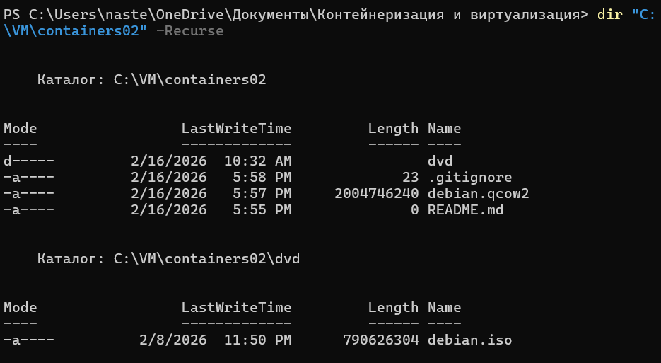

### 3.3 Создан виртуальный диск для Debian (8 GB, qcow2):

```
qemu-img create -f qcow2 debian.qcow2 8G
```

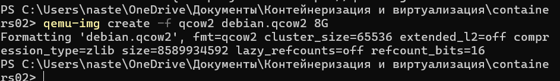
Для ознакомления  дополнительными параметрами утилиты выполнела команду:

```
qemu-img --help
```

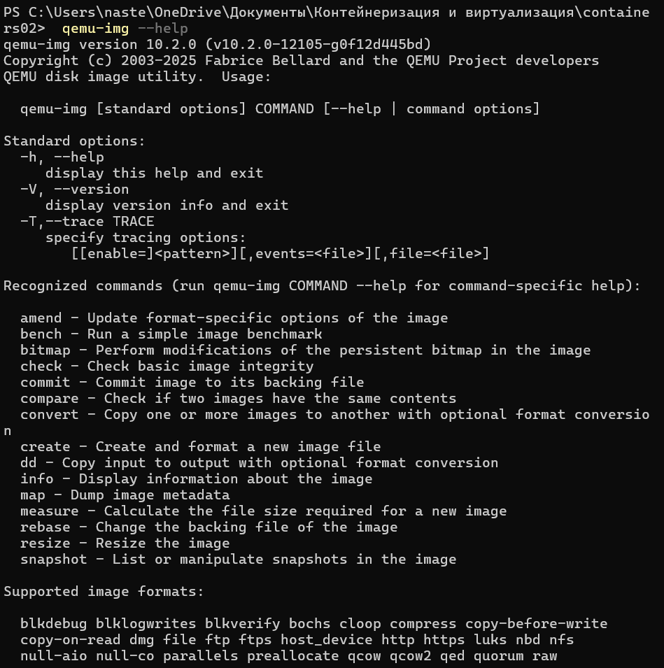

### 3.4 Запущена установка Debian на виртуальную машину из ISO:

```
qemu-system-x86_64 -hda debian.qcow2 -cdrom dvd\debian.iso -boot d -m 2G
```

При установке использовала  параметры:

**Имя компьютера:** debian;

**Хостовое имя:** debian.localhost;

**Имя пользователя:** user;

**Пароль пользователя:** password;

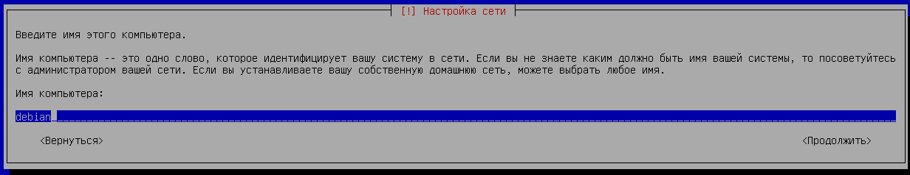

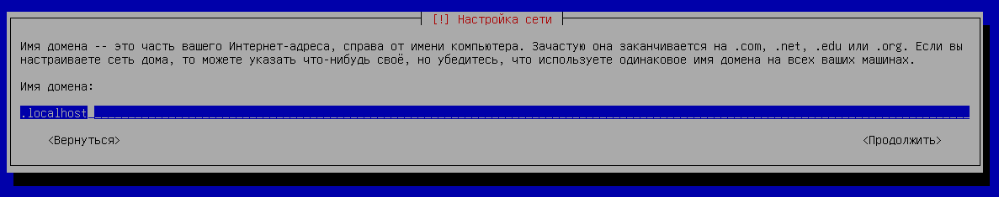

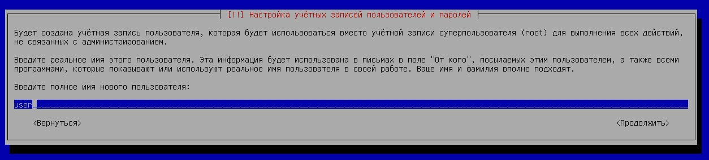

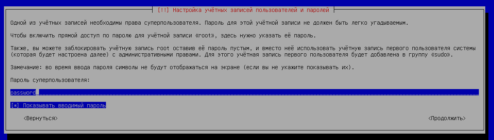

### 3.5. Запуск виртуальной машины после установки с пробросом портов

Повторный запуск виртуальной машины:

```
qemu-system-x86_64 -hda debian.qcow2 -m 2G -smp 2 -device e1000,netdev=net0 -netdev user,id=net0,hostfwd=tcp::1080-:80,hostfwd=tcp::1022-:22
```

Назначение проброса портов:

 - `http://...:1080` → внутри VM порт 80 (Apache)
 - `ssh ...:1022` → внутри VM порт 22 (SSH)

### 3.6. Установка LAMP в виртуальной машине

Переход в суперпользователя и установка пакетов.

```
su
apt update -y
apt install -y apache2 php libapache2-mod-php php-mysql mariadb-server mariadb-client unzip
```

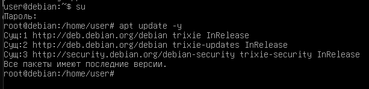

### 3.7. Скачивание phpMyAdmin и WordPress

Скачивание WordPress:
```
wget https://wordpress.org/latest.zip
ls -l
```

`WordPress` скачался (200 OK, файл latest.zip есть)


Попытка скачать `phpMyAdmin` завершилась ошибкой 404:

```
wget https://files.phpmyadmin.net/phpMyAdmin/5.2.2/phpMyAdmin-5.2.2-all-languages.zip
```

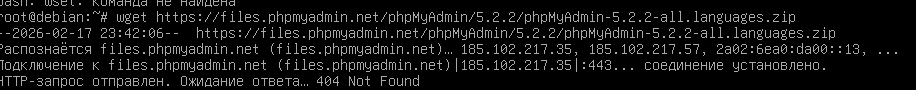

После этого `phpMyAdmin` был скачан по рабочей ссылке и сохранён под именем phpmyadmin.zip:
```
cd /root
wget -O phpmyadmin.zip https://files.phpmyadmin.net/phpMyAdmin/5.2.2/phpMyAdmin-5.2.2-all-languages.zip
ls -l
```

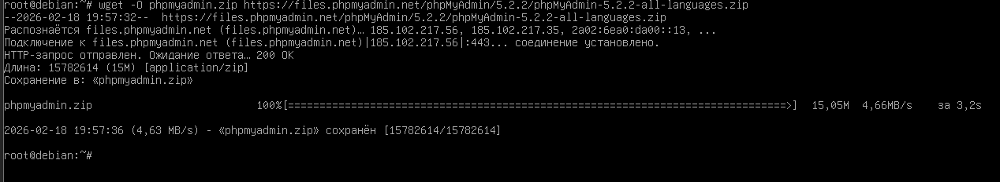

### 3.8. Распаковка в /var/www

У меня архив PhpMyAdmin был скачан под именем `phpmyadmin.zip`, поэтому выполнила следующие команды:

```
mkdir -p /var/www

# PhpMyAdmin

unzip phpmyadmin.zip
mv phpMyAdmin-5.2.2-all-languages /var/www/phpmyadmin

# WordPress

unzip latest.zip
mv wordpress /var/www/wordpress
```


### 3.9. Создание БД и пользователя MariaDB для WordPress

```
mysql -u root

CREATE DATABASE wordpress_db;
CREATE USER 'user'@'localhost' IDENTIFIED BY 'password';
GRANT ALL PRIVILEGES ON wordpress_db.* TO 'user'@'localhost';
FLUSH PRIVILEGES;
EXIT;
```


Права пользователя проверены командой:

```
mysql -u root -e "SHOW GRANTS FOR 'user'@'localhost';"
```

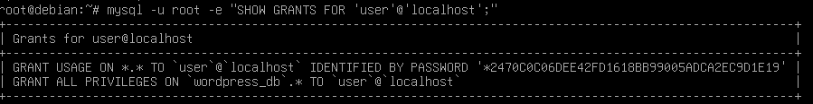


### 3.10. Настройка VirtualHost Apache

Созданы файлы в /etc/apache2/sites-available

01-phpmyadmin.conf:

```
nano /etc/apache2/sites-available/01-phpmyadmin.conf
```

Содержимое:

```
<VirtualHost *:80>
    ServerAdmin webmaster@localhost
    DocumentRoot "/var/www/phpmyadmin"
    ServerName phpmyadmin.localhost
    ServerAlias www.phpmyadmin.localhost
    ErrorLog "/var/log/apache2/phpmyadmin.localhost-error.log"
    CustomLog "/var/log/apache2/phpmyadmin.localhost-access.log" common
</VirtualHost>
```

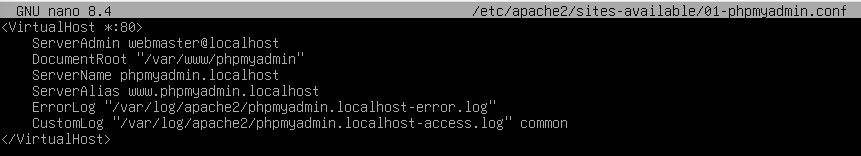

02-wordpress.conf:

```
nano /etc/apache2/sites-available/02-wordpress.conf
```

Содержимое:

```
<VirtualHost *:80>
    ServerAdmin webmaster@localhost
    DocumentRoot "/var/www/wordpress"
    ServerName wordpress.localhost
    ServerAlias www.wordpress.localhost
    ErrorLog "/var/log/apache2/wordpress.localhost-error.log"
    CustomLog "/var/log/apache2/wordpress.localhost-access.log" common
</VirtualHost>
```

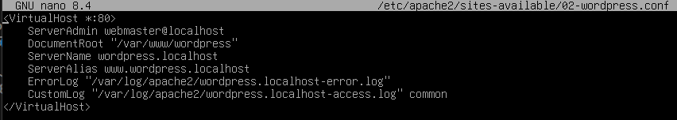

### 3.11. Регистрация конфигураций (a2ensite)

```
/usr/sbin/a2ensite 01-phpmyadmin
/usr/sbin/a2ensite 02-wordpress
```

### 3.12. Проверка конфигурации Apache

```
/usr/sbin/apache2ctl configtest
```

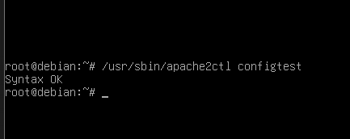

### 3.13. Добавление имён сайтов в /etc/hosts

```
127.0.0.1 phpmyadmin.localhost
127.0.0.1 wordpress.localhost
```

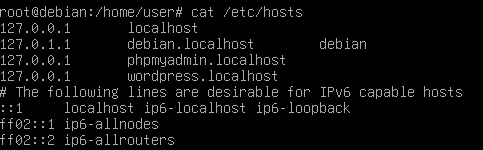

## 4. Запуск и тестирование

### 4.1. Проверка системы

```
uname -a
```

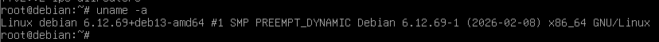

**Выводит:**

- имя ОС/ядра (Linux)
- имя хоста
- версия ядра
- архитектура (x86_64)
- дополнительная информация о сборке

### 4.2. Перезагрузка Apache Web Server

Перезагрузка Apache Web Server:
```
systemctl restart apache2
```

(для проверки статуса можно)
```
systemctl status apache2 --no-pager
```

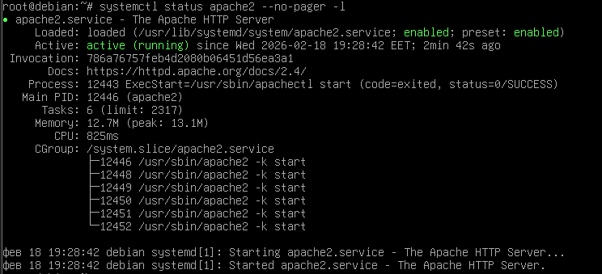

Подтверждает:
- Apache активен (active (running))
- Cервис включён (enabled)

### 4.3. Проверка сайтов в браузере (хостовая машина)

Проверены адреса (по требованию):

- http://wordpress.localhost:1080
- http://phpmyadmin.localhost:1080

Результат:

- `WordPress` открылся и установка была успешно завершена через веб-интерфейс.
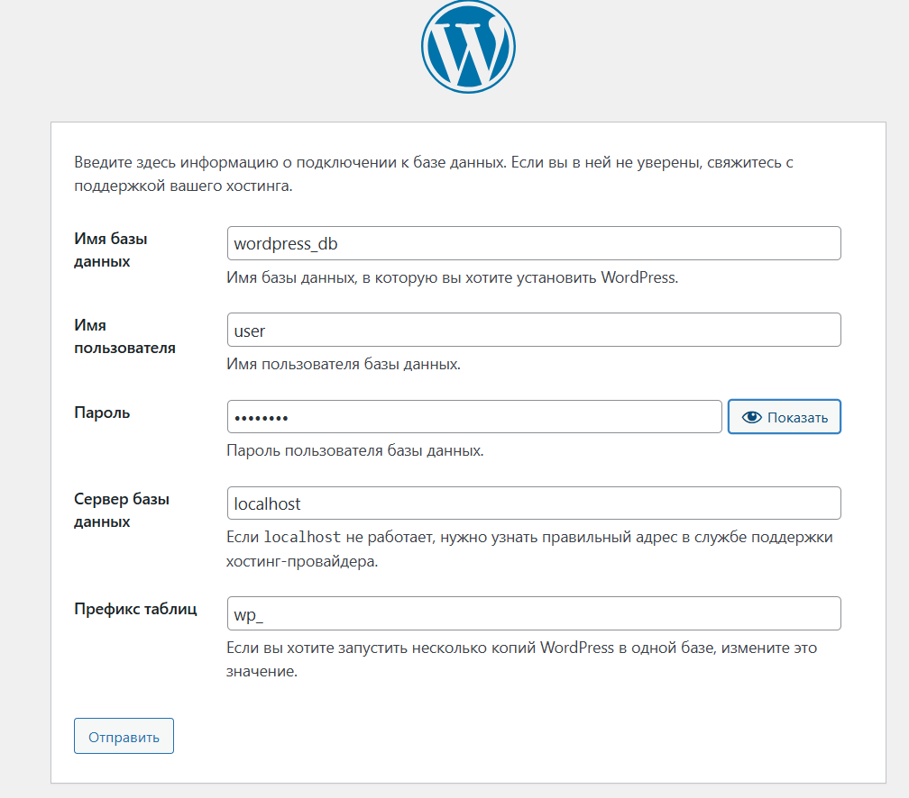
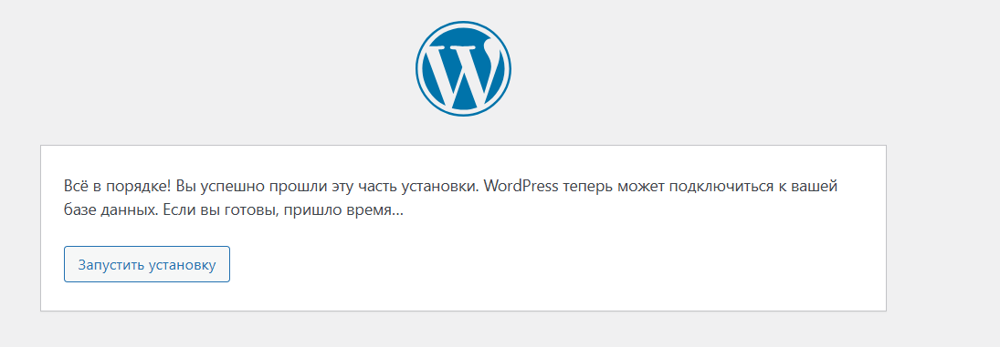
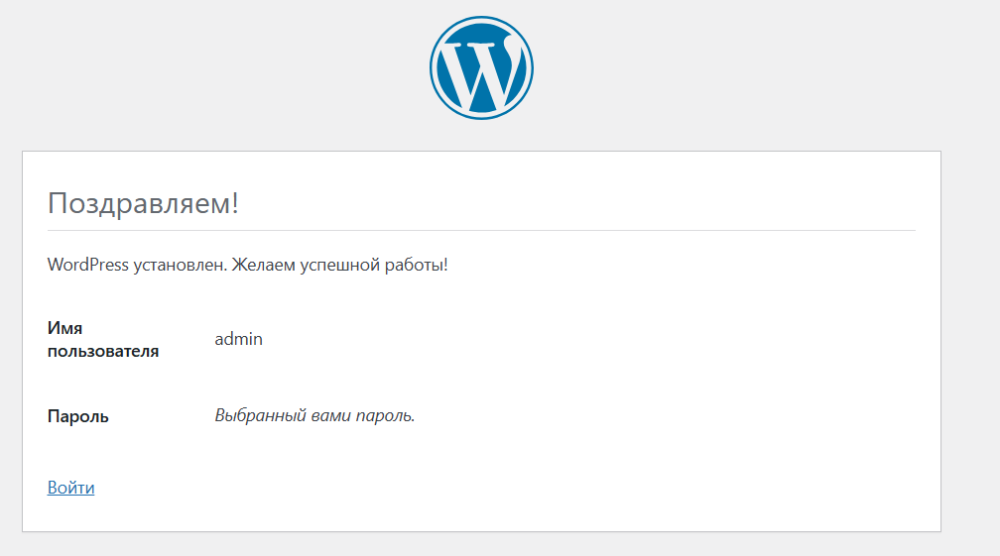

- `phpMyAdmin` — открывается через phpmyadmin.localhost:1080.

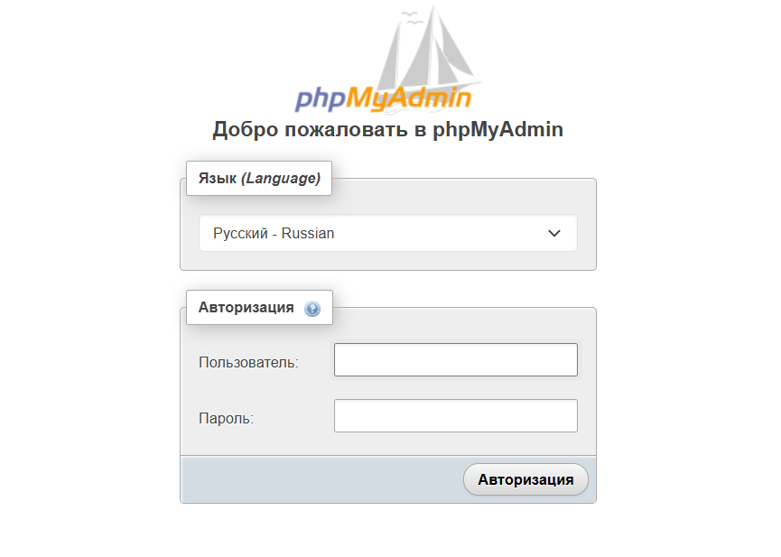

## 5. Ответы на вопросы

### 1. Каким образом можно скачать файл в консоли при помощи утилиты wget?

Для скачивания файла используется команда:

```bash
wget <URL>
```

Команда загружает файл по указанной ссылке в текущую директорию

При необходимости можно указать имя сохраняемого файла:

```
wget -O имя_файла.zip <URL>
```

### 2. Зачем необходимо создавать для каждого сайта свою базу и своего пользователя?

Создание отдельной базы данных и отдельного пользователя необходимо для:

- разграничения доступа (каждый сайт работает только со своей БД);
- повышения безопасности (если один сайт взломают, остальные не пострадают);
- упрощения администрирования (резервное копирование, перенос и удаление выполняются независимо)
- соблюдения принципа минимальных привилегий

### 3. Как поменять доступ к системе управления БД на порт 1234?

1. Открыть конфигурационный файл MariaDB:
```
nano /etc/mysql/mariadb.conf.d/50-server.cnf
```

2. Изменить или добавить параметр:
```
port = 1234
```

3. Перезапустить службу:
```
systemctl restart mariadb
```

4. При необходимости добавить проброс порта в QEMU:
```
hostfwd=tcp::1234-:1234
```

### 4. Какие преимущества даёт виртуализация?

- изоляция среды (ошибки в виртуальной машине не влияют на хостовую систему);
- возможность тестирования и экспериментов без риска;
- быстрое развертывание и удаление серверов;
- переносимость (виртуальная машина — это набор файлов);
- эффективное использование аппаратных ресурсов

### 5. Для чего необходимо устанавливать время / временную зону на сервере?

- корректная запись логов (Apache, MariaDB и других служб);
- правильная работа задач по расписанию ;
- корректная работа сертификатов и сетевых протоколов;
- упрощение анализа и диагностики ошибок

### 6. Сколько места занимает установленная ОС (виртуальный диск) на хостовой машине?

Размер зависит от объёма установленного ПО и данных.
Формат qcow2 использует динамическое выделение пространства, поэтому файл занимает только фактически использованный объём.

Проверка размера:

```
dir .\debian.qcow2
```
или
```
qemu-img info debian.qcow2
```
### 7. Какие есть рекомендации по разбиению диска для серверов? Почему рекомендуется так разбивать диск?

Рекомендуется выделять отдельные разделы:

- `/` — системный раздел;
- `/var` — логи, базы данных, веб-сайты;
- `/home` — пользовательские данные (при необходимости);
- `swap` — область подкачки.

Такое разбиение позволяет:

- предотвратить переполнение системного раздела из-за роста логов или данных;
- повысить устойчивость системы;
- упростить резервное копирование и обслуживание;
- лучше контролировать использование дискового пространства.


## 6 Вывод

В ходе работы был установлен сервер Debian в среде виртуализации QEMU и создан виртуальный диск формата qcow2.

Был настроен стек LAMP (Apache, MariaDB, PHP), развернуты WordPress и phpMyAdmin, созданы база данных и пользователь.

Также были настроены отдельные VirtualHost для каждого сайта и выполнен проброс портов для доступа с хостовой машины.

В результате виртуальный сервер корректно работает, сайты открываются в браузере, а настройка выполнена успешно

## 7. Библиография

1. Курс Moodle "Контейнеризация и Виртуализация"
   [https://elearning.usm.md/course/view.php?id=6806](https://elearning.usm.md/course/view.php?id=6806)
2. Документация QEMU (запуск VM, hostfwd и т.д.)
   [[https://sysmasters.net/faqs/kak-zapustit-ostanovit-ili-perezapustit-apache](https://www.qemu.org/docs/master)
3. Руководство по установке Debian
   [https://www.debian.org/releases/stable/installmanual](https://www.debian.org/releases/stable/installmanual)
4. Chat GPT
   [https://chatgpt.com/](https://chatgpt.com/)
